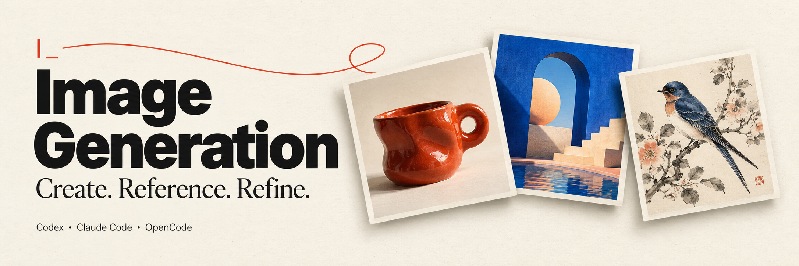

# Image Generation



[](#compatibility-and-status) [](#codex) [](#claude-code) [](#opencode-v2) [](#install) [](#connect-your-providers)

**Create the image you need. Keep building in the same conversation.**

Generate project artwork, combine reference images, and refine the result with your coding agent. Images are saved directly into your project. Bring your own **OpenAI, Google Gemini, Replicate, or OpenRouter** keys; configure them once and use them across **Codex, Claude Code, and OpenCode v2**.

**11 curated models** · **Generation + references + editing** · **Shared OS credential storage**

**Table of contents** · [Install](#install) · [Connect providers](#connect-your-providers) · [First image](#create-your-first-image) · [Models](#supported-models) · [Troubleshooting](#troubleshooting)

## Install

You need [Node.js 24+ with npm](https://nodejs.org/en/download), [Git](https://git-scm.com/downloads), and a local installation of your client. You do not need to clone this repository or build the plugin.

> [!IMPORTANT]
> This repository is currently private. The GitHub account used by Git on your computer must have access. You will also need an API key and API credits from at least one image provider in the next step.

Choose the client you use:

| Client | Start here |
| --- | --- |
| **Codex** | [Register the marketplace from a chat, then install in Plugins](#codex) |
| **Claude Code** | [Paste the complete slash commands into your session](#claude-code) |
| **OpenCode v2** | [Ask OpenCode to run its plugin installer](#opencode-v2) |

### Codex

**In the desktop app**

1. Open a local Codex chat and paste this request. Codex uses its CLI to register the GitHub marketplace for your OS user:

   ```text
   Add the Image Generation plugin marketplace for me by running:
   codex plugin marketplace add ossianravn/image-generation-plugin

   Then run codex plugin marketplace list and confirm that
   image-generation is registered.
   ```

2. After registration succeeds, restart the desktop app and open **Plugins**. Select the **Image Generation** marketplace, open the **Image Generation** plugin, and click its **+** install button.
3. Start a new chat. Paste this to confirm the tools are available:

   ```text
   Use Image Generation's credential_status tool to check which image
   providers are configured and show me the provider setup command.
   ```

**Ready for the next step:** Codex returns provider status and a terminal setup command. With a fresh installation, no providers configured is expected. [Connect your providers below.](#connect-your-providers)

If Codex reports that the `codex` executable is missing, open your terminal and run `npm install -g @openai/codex`, then reopen the app and repeat step 1.

<details>
<summary>Codex CLI / install directly from your terminal</summary>

Run these commands one at a time in your terminal:

```sh
codex plugin marketplace add ossianravn/image-generation-plugin
codex plugin add image-generation@image-generation
```

Start a new Codex session and use the credential-status request above. To browse the registered marketplace from inside a Codex CLI session, enter `/plugins`, select Image Generation, and install it there.

</details>

The desktop route uses [marketplace registration](https://developers.openai.com/plugins/build/plugins#add-a-marketplace-from-the-cli) followed by the [Plugins directory](https://learn.chatgpt.com/docs/plugins#install-and-use-a-plugin).

### Claude Code

**Inside an interactive Claude Code session**

Paste each command into **Claude Code's prompt**, pressing Enter after each one. These are slash commands for the client.

1. Add this plugin's GitHub marketplace:

   ```text
   /plugin marketplace add ossianravn/image-generation-plugin
   ```

2. Open the Image Generation install screen:

   ```text
   /plugin install image-generation@image-generation
   ```

3. Select **Install for you (user scope)** to make it available across your projects. Complete installation in the plugin panel.
4. If Claude asks you to reload, enter:

   ```text
   /reload-plugins
   ```

5. Enter `/plugin`, open **Installed**, and check that **image-generation** is enabled.

**Ready for the next step:** the plugin appears under Installed. [Connect your providers below.](#connect-your-providers)

<details>
<summary>Claude Desktop — install through the Code tab's plugin browser</summary>

Use a **local** session in the **Code** tab. To register this private marketplace first, run this once in your terminal:

```sh
claude plugin marketplace add ossianravn/image-generation-plugin
```

Then, in Claude Desktop:

1. Click **+** beside the prompt box → **Plugins** → **Add plugin**.
2. Find **image-generation** and open it.
3. Select your **user account** as the install scope and complete installation.
4. Open **+** → **Plugins** → **Manage plugins** to confirm it is enabled.

If you already installed at user scope using the session instructions above, that installation is shared with local Claude Desktop sessions on the same computer. The Code tab's cloud sessions do not load this local plugin. See [Claude Desktop's plugin instructions](https://code.claude.com/docs/en/desktop#install-plugins).

</details>

<details>
<summary>Prefer ordinary terminal commands?</summary>

Run these commands one at a time in PowerShell, Terminal, or your shell:

```sh
claude plugin marketplace add ossianravn/image-generation-plugin
claude plugin install image-generation@image-generation
```

Start a new Claude Code session, or enter `/reload-plugins` in the session you already have open. Then [connect your providers](#connect-your-providers).

</details>

The session commands and scope choices follow [Claude Code's installation guide](https://code.claude.com/docs/en/discover-plugins).

### OpenCode v2

**From an OpenCode conversation**

OpenCode v2 manages Git plugins through its CLI. You can ask the agent to perform that installation from your current conversation:

1. Paste this request into OpenCode:

   ```text
   Install the Image Generation plugin for my user account by running:
   opencode plugin add github:ossianravn/image-generation-plugin

   Confirm whether installation succeeded.
   ```

2. After installation succeeds, close and reopen OpenCode in your project.
3. Paste this request into the new conversation:

   ```text
   Check Image Generation's connection with opencode mcp list.
   Then use its credential_status tool to show which image providers
   are configured and give me the provider setup command.
   ```

**Ready for the next step:** `image-generation` is connected and the agent can check credentials. The plugin adds both image tools and its workflow skill. [Connect your providers below.](#connect-your-providers)

<details>
<summary>Install directly from your terminal</summary>

Run:

```sh
opencode plugin add github:ossianravn/image-generation-plugin
```

Reopen OpenCode in your project, then check the connection:

```sh
opencode mcp list
```

Look for `image-generation  connected`. Continue with provider setup below.

</details>

This uses [OpenCode v2's Git package installer](https://opencode.ai/v2/docs/plugins/#manage). OpenCode v1 is not supported by this adapter.

> [!NOTE]
> The first connection downloads the plugin's locked runtime dependencies into a local cache. Allow that setup to finish; later launches reuse it. If the client times out on that first connection, reconnect or reopen it after setup completes.

## Connect your providers

**Do this once per computer and OS user.** The same saved keys work across all three clients. Your coding-agent subscription does not include image API credits.

**1. Create a key for at least one provider.**

| Provider | Get an API key | Models available through this plugin |
| --- | --- | --- |
| OpenAI | [OpenAI Platform](https://platform.openai.com/api-keys) | GPT Image |
| Google Gemini | [Google AI Studio](https://aistudio.google.com/apikey) | Nano Banana |
| Replicate | [Replicate API tokens](https://replicate.com/account/api-tokens) | FLUX |
| OpenRouter | [OpenRouter keys](https://openrouter.ai/settings/keys) | Seedream, MAI, Grok, Qwen, Muse |

**2. Open your own terminal and paste this complete command.**

```sh
npx --yes --package=git+https://github.com/ossianravn/image-generation-plugin.git image-generation setup
```

The absolute setup command returned by your agent works too; it uses the copy already installed on your computer.

**3. Select your providers and enter their keys.**

Use the arrow keys to move, **Space** to select providers, and **Enter** to continue. Enter each API key at its masked prompt. Keys are saved in **Windows Credential Manager**, **macOS Keychain**, or **Linux Secret Service**. Paste keys into this terminal wizard only.

**4. Return to your agent and paste:**

```text
Provider setup is complete. Use Image Generation to refresh my
credential status and show the models available for my providers.
```

**You're ready when** your chosen providers are reported as configured. This checks stored keys; your provider account still controls model access and available credits.

Run the same setup command whenever you want to add or update a provider. Headless environments and environment-variable overrides are covered in [advanced setup](docs/setup.md#environment-and-file-overrides).

## Create your first image

### Start with an idea

Paste into any supported client:

```text
Use Image Generation to create a square product illustration of a
red ceramic mug on a pale blue background. Use a model from one of
my configured providers, save it in this project's assets folder,
and show me the result.
```

You get the original image saved locally, its file path, and a preview when your client supports it. You can request a particular provider or model by name.

### Bring references

Attach two images, or give the agent their local file paths, then paste:

```text
Use Image Generation with these two references. Keep the product
from the first image and use the setting from the second.
Save the composition in assets/product.
```

### Refine the result

Continue in the same conversation:

```text
Edit the image you just created. Make the mug dark green, preserve
the shape, lighting, and composition, and save a new version.
```

Each revision gets its own file. The plugin does not silently change your selected provider or model, and it does not automatically submit another paid generation after an uncertain outcome.

## Supported models

| Provider | Curated models |
| --- | --- |
| OpenAI | GPT Image 2.5 Flare, GPT Image 2.5 Sunburst |
| Google Gemini | Nano Banana 2, Nano Banana Pro |
| Replicate | FLUX 3 Image |
| OpenRouter | Seedream 5.0 Pro, MAI-Image-2.6, Grok Imagine Image 2.0, Qwen Image 3, Qwen Image 3 Pro, Muse Image |

All 11 models completed text generation, composition using two references, and a subsequent edit in the **3 October 2026** live validation run. Those 33 outputs were saved, decoded, checked, and visually reviewed. Available sizes, formats, masks, transparency, and reference limits vary by model; the core workflow tests do not cover every option.

Ask **“Which image models can I use?”** to see your configured providers and the catalogue. See the [tested model catalogue](docs/model-catalogue.md) for exact model IDs, controls, and evidence.

## Privacy and costs

- **You pay the selected provider.** Generating and editing images use your API credits. Installing the plugin, checking local credentials, and inspecting a local image do not generate images.
- **Requests go to that provider.** Prompts and reference images are uploaded when you generate or edit. Provider retention policies and account settings apply.
- **Original files stay in your project.** Results have unique filenames; editing creates a new asset.
- **Keys use OS storage.** Environment and explicitly selected credential files can override saved keys. Plaintext files remain an optional development or headless configuration.
- **Jobs can be recovered.** Local metadata tracks existing actions so a disconnect does not automatically cause another paid submission. It omits original prompts and copies of input references. Pending results may be retained until they are saved.

Gemini requests use `store=false`, and FLUX web grounding defaults off. See [data and recovery details](docs/setup.md#recovery-and-cancellation).

## Troubleshooting

| What you see | What to do |
| --- | --- |
| Repository not found or permission denied | Confirm your Git credentials have access to this private repository. |
| `node` or `npm` not found | Install Node.js 24+ with npm, then reopen the client so it sees the updated PATH. |
| `codex` not found during marketplace registration | Run `npm install -g @openai/codex` in your terminal, reopen Codex, then repeat registration. |
| Claude's slash command is treated as an ordinary message | Use the interactive Claude Code session, or expand the Claude Desktop / terminal instructions above for your surface. |
| Tools are missing after installation | Start a new session. In Claude Code, check `/plugin` → **Installed** and run `/reload-plugins` if needed. In OpenCode, check `opencode mcp list`. |
| Server still starting on first use | Allow dependency setup to finish. If the client times out, reconnect the MCP server; setup is safe to retry. |
| No provider configured | Ask the agent to run `credential_status`, then use its terminal setup command. |
| A saved key is not being used | Check `credential_status`: environment variables and explicit credential files take precedence. |
| OS credential store unavailable | Unlock the OS store. Linux needs a running Secret Service such as GNOME Keyring or KWallet; use an explicit environment/file override for headless use. |
| Provider rejects a request | Check the key's account access, API credits, and the selected model's supported options. |
| Connection lost during generation | Ask the agent to retrieve the existing job before requesting another generation. |
| Preview is unavailable | Open the returned file path. Preview rendering depends on the client. |

For credential rotation/removal, direct MCP configuration, updates, and uninstall behavior, see the [setup guide](docs/setup.md).

## Compatibility and status

**v0.2.0 is an early release**, developed against Codex CLI 0.160.0, Claude Code 2.1.288, OpenCode 2.0.18, and Node 24.19.0. The portable package follows [Agent Plugins 1.0](https://agent-plugins.org/specification), with installation adapters for each client.

Direct GitHub installation has been checked in all three clients on Windows. Automated checks passed in Windows, macOS, and Linux CI. The runtime also has real MCP subprocess checks, a Windows credential-store check, and recorded live provider workflows. Native macOS Keychain/Linux Secret Service access and image rendering in fresh interactive client sessions still need acceptance testing. See the [validation report](docs/validation.md) for the exact boundaries of the evidence.

The repository is private, the package is not published to npm, and a license has not yet been assigned.

## Development

<details>
<summary>Build, test, or contribute from a local checkout</summary>

```sh
git clone https://github.com/ossianravn/image-generation-plugin.git
cd image-generation-plugin
npm ci
npm run build:runtime
node dist/cli.js setup
npm run typecheck
npm test
npm run validate
```

`npm run dev -- models` explicitly loads the ignored `.env.local` for development. Normal installed launches do not search your project for dotenv files.

| Command | Purpose |
| --- | --- |
| `npm run test:install` | Test a source-only install with real dependency setup and modern/legacy MCP connections; requires npm network access. |
| `npm run test:credentials:os` | Exercise the real OS store using an isolated synthetic credential, then delete it. |
| `npm run package` | Build portable and Claude bundles with dependencies for the current OS and architecture. |
| `npm run test:live -- --model MODEL_ID --run UNIQUE_RUN_NAME` | Run paid generation, reference, and editing checks using `.env.local`. |

The shared MCP service exposes `credential_status`, `list_models`, `get_model`, `generate_image`, `edit_image`, `get_job`, `cancel_job`, and `inspect_image`. The client adapters reuse that service and the same Agent Skill.

</details>

---

[Setup guide](docs/setup.md) · [Model catalogue](docs/model-catalogue.md) · [Validation](docs/validation.md) · [Architecture](docs/implementation-plan.md) · [Dated research](docs/research-2026-10-03.md)
