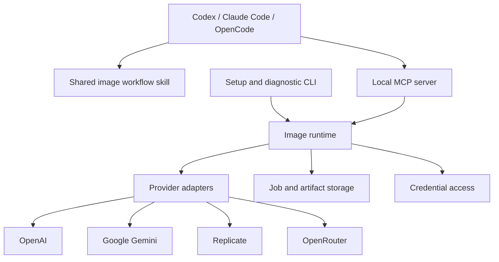

# Image generation plugin implementation plan

**Status:** approved design record. The implementation now exists; the proposal below is retained as the pre-implementation baseline, not a statement of current blockers.
**Last reviewed:** 2026-10-03.
**Audience:** project owner and implementers.
**Evidence:** [dated research and primary sources](research-2026-10-03.md).

## Implementation outcome — 3 October 2026

The shared runtime, CLI, four provider adapters, eight MCP tools (including `inspect_image` and `credential_status`), shared skill, durable SQLite jobs, and host package generator are implemented. Node 24+, MCP server 2.3.0, Zod 4.6.5, Sharp 0.35.5, and the development tooling were explicitly approved. The user also approved the overwrite, retry, routing, local-retention, Gemini storage, and FLUX grounding defaults described below.

The user subsequently selected one shared OS credential store across hosts. Version 0.2.0 adds masked terminal setup through Inquirer 8.7.2 and platform storage through @napi-rs/keyring 2.1.0, with environment and explicit-file overrides. The image server resolves credentials itself; hosts receive no generated plaintext key configuration. Every action selects a provider and model explicitly; there is no configurable default-model preference yet. SQLite owns cross-process deduplication and recovery. Ordinary MCP job tools provide asynchronous work without requiring the Tasks extension.

The user also approved direct GitHub installation support. Repository marketplace entries now point Codex and Claude at the shared plugin, while an OpenCode v2 adapter registers its MCP service and skill. Git installs prepare locked production dependencies in a content-addressed data-directory cache; prebuilt bundles keep their existing compiled runtime. This revises the baseline's requirement to ship only built JavaScript: source installs run the existing erasable TypeScript with Node 24 after copying it outside `node_modules`. No compiler or new production dependency is required. Concurrent setup publishes only completed runtimes; failed setup does not leave an executable partial cache.

Muse's route discrepancy was resolved against the dedicated Image API, using a dated curated endpoint descriptor when discovery returns an empty list. No chat adapter or automatic route fallback is used. Gemini uses stable `/v1/interactions`, `user_input`, `models/` IDs, and `store=false`; the live API rejects the documented optional inline-delivery field, so it is omitted.

See the [current setup guide](setup.md), [model evidence](model-catalogue.md), and [validation report](validation.md) for actual behavior, completed checks, and remaining host/OS release work. Public publication and a license are still undecided. The following sections preserve the original design and proposed acceptance criteria.

Build one local image service that coding agents can use to create, inspect, and revise project assets. Package its tools and instructions for each supported host. Keep provider differences inside adapters and keep the host agent responsible for understanding the user's creative intent.

## Table of contents

- [Outcome and scope](#outcome-and-scope)
- [Architecture](#architecture)
- [Host packaging](#host-packaging)
- [Provider integration](#provider-integration)
- [Jobs and artifacts](#jobs-and-artifacts)
- [Credentials and policy](#credentials-and-policy)
- [Implementation sequence](#implementation-sequence)
- [Decisions before implementation](#decisions-before-implementation)
- [Release criteria and maintenance](#release-criteria-and-maintenance)

## Outcome and scope

A user connects a provider once, asks their coding agent for an asset, receives a viewable image and durable local file, and can refer to that image in a later edit. They can select a provider/model or configure a default. A missing key or unsupported request identifies the specific next action.

The plugin runs on the user's machine. Prompts and selected reference images still travel to the chosen external provider; local execution does not mean local inference. The host's subscription is not treated as an API credential.

| Scope | Status |
| --- | --- |
| Local runtime with users' provider keys | Confirmed by the user |
| OpenAI, Gemini, Replicate, and OpenRouter | Requested |
| Codex, Claude Code, and OpenCode | Requested first hosts |
| Generation, reference images, and image editing | Confirmed by the user for v1 |
| Tested model catalogue covering the main labs plus Qwen and Muse | Confirmed by the user; exact shortlist and route evidence in the [catalogue](model-catalogue.md) |
| Windows, macOS, and Linux | Proposed release targets; each needs evidence |
| GitHub releases and local/plugin marketplaces | Proposed first distribution channels |

Keep hosted accounts, billing, a web gallery, automatic cross-provider routing, training, and video out of the first release. Treat additional agent hosts as separately tested integrations. Transparent output and masks are model capabilities, not promises made for every provider.

The confirmed image workflows are creating a new image from text, using supplied reference images to guide a new image, and editing an existing or previously generated image. Reference count and editing controls follow the selected model's capabilities.

The proposed initial shortlist contains 11 models across OpenAI, Google, Black Forest Labs, ByteDance, Microsoft, xAI, Qwen, and Meta. The [model catalogue](model-catalogue.md) maps each to a primary provider route and records outstanding validation. A benchmark appearance is evidence for investigation, not a plugin compatibility result. Muse remains in requested scope, with an API-route discrepancy to resolve before promising its operations.

## Architecture

Recommend TypeScript on a supported Node.js LTS release, compiled into a distributable runtime. Use the official MCP SDK v2 and its documented `serveStdio` entry with legacy compatibility enabled. Its current documentation covers both the 2026-07-28 and earlier protocol families. Pin the exact dependency versions after the compatibility spike. [SDK guidance](https://ts.sdk.modelcontextprotocol.io/v2/migration/support-2026-07-28)

Use one package with cohesive modules initially. A multi-package monorepo would add release coordination before there is a demonstrated need.

| Owner | Responsibility |
| --- | --- |
| Shared skill | Interpret creative requirements, choose from actual capabilities, inspect references, and present the result |
| MCP boundary | Publish concise schemas, validate arguments, adapt protocol results, and report progress |
| Runtime | Resolve configuration, select an adapter, own job transitions, and persist artifacts |
| Provider adapter | Translate supported parameters, authenticate, submit, normalize responses/errors, and recover provider jobs where possible |
| Artifact storage | Save complete image bytes, report actual format/dimensions, and retain provenance needed for follow-up work |
| CLI | Configure credentials/defaults and diagnose installation using the same runtime services |

Proposed tool surface: `list_models`, `get_model`, `generate_image`, `edit_image`, `get_job`, and `cancel_job`. Generation and editing both accept reference images where the selected model supports them. Keep provider catalogs behind discovery tools rather than creating one tool per model.

The common request expresses provider, model, prompt, output destination, and supported image controls. Editing adds source/reference artifacts and an optional mask only when supported. Provider-specific options use an adapter-owned schema; they cannot overwrite authentication or transport configuration.

A model descriptor carries its lab/model identity, provider route, API family, documented operation support, parameter schema, reference limits, output capabilities, and evidence date. Record discovered, documented, and live-tested evidence separately by operation; availability is a separate observation. A successful generation does not certify editing, and a direct-provider test does not certify the aggregator route for the same model.

Results carry a job ID, state, provider/model identity, artifact records, useful warnings, and usage/cost when supplied. An artifact has a durable ID, absolute local path, MIME type, actual dimensions, and original bytes. Provider-specific continuation state stays opaque to the host model.

Return native MCP image content or resources where the host supports them, alongside a reliable file location. Verify actual rendering and model visibility in each host. A path on the server's filesystem is not a portable preview for a remote host.

## Host packaging

Author one canonical source and generate release packages that reuse its runtime and skills. Packaging code owns filename and variable differences; provider modules never check which host called them.

| Target | Proposed delivery |
| --- | --- |
| Agent Plugins / current Codex | Root `plugin.json`, root `mcp.json`, and `skills/`; optional Codex presentation under `extensions.com.openai` |
| Claude Code | Separate release layout with `.claude-plugin/plugin.json` and `.mcp.json`, using the same compiled runtime and skill content |
| OpenCode v2 | Version-specific MCP configuration under `mcp.servers`, plus installation/discovery of the shared skills |
| OpenCode v1 | Separately labeled compatibility recipe if included in the supported version range |
| Other MCP hosts | Generic stdio setup, with only the tested capabilities advertised |

Agent Plugins 1.0.0 standardizes the package; it does not establish identical host behavior. Validate the portable manifest and MCP configuration against their matching versioned schemas, and the skills against Agent Skills. Host-native compatibility files should not become a second portable source of truth. [Specification](https://agent-plugins.org/specification)

Portable MCP uses a single executable token plus separate arguments. Ship built JavaScript and use `node` with an explicit package-relative script argument. Avoid a shell-dependent bootstrap or downloading `@latest` every time a host starts. Installation should establish runtime prerequisites once.

The portable subprocess working directory is the plugin root. Consequently, never infer the user's project output directory from the server's `cwd`. Pass the requested destination explicitly. Put plugin state in the host's persistent data location, normalize host-specific data paths at startup, and write outputs outside the immutable installation.

OpenAI's current public directory submission guidance calls for remote HTTPS MCP or an exception for local MCP. A local GitHub/marketplace release is a separate delivery path. Do not promise public directory approval as a v1 acceptance criterion. [OpenAI packaging guidance](https://developers.openai.com/plugins/build/plugins)

## Provider integration

Use direct adapters for all four requested services. Direct OpenAI/Gemini support remains useful even when the same models appear on aggregators: credentials, billing, routing, retention, and supported parameters differ.

| Provider | Initial integration proposal | Consequential difference |
| --- | --- | --- |
| OpenAI | Images API for generation and editing; evaluate `gpt-image-2.5-flare` and `gpt-image-2.5-sunburst` as initial candidates | Preserve masks, transparency, format, and quality controls according to the selected model |
| Gemini | Interactions API; evaluate `gemini-3.1-flash-image`, then other image variants by use case | Handle mixed output parts and continuation state; decide explicitly whether to store provider interactions |
| Replicate | Predictions API plus model/version input schemas | Model-specific fields, asynchronous prediction lifecycle, cancellation, and expiring output files |
| OpenRouter | Dedicated Image API and image-model/per-endpoint discovery; investigate a chat image path for Muse | Capabilities differ by endpoint; Muse currently appears in the general API but has no dedicated Image API endpoints |

The candidates above are documented as of the research date, not live-tested selections. The [provider evidence](research-2026-10-03.md#provider-baseline) links the exact official pages.

For OpenAI, let the host agent manage conversation and call the Images API for individual actions. Add a Responses-based flow only if a demonstrated editing requirement benefits from its stateful capabilities; it introduces an additional orchestration model and cost.

For Gemini, inspect all relevant image output parts rather than saving only the final convenience-property image. Local artifact-based editing can be the common path. Provider-native conversation continuation can retain exact opaque state without exposing internal reasoning as user output.

For Replicate, begin with `black-forest-labs/flux-3-image` and verify its generation and reference/edit workflows. Resolve and record the executed model version where exposed, otherwise record the requested ID and returned metadata without inventing a pinned version. Arbitrary models require their real schema and an image-output contract; accepting any model ID alone is insufficient.

For OpenRouter, constrain the selected route to endpoints that satisfy the requested controls. Preserve routed-provider identity when available. Investigate Muse's general/chat image route early: its model page describes references and editing, while the general endpoint metadata and empty Image API endpoint list do not establish usable support. If the route is confirmed, implement an explicit second translation path within the OpenRouter adapter. Do not silently change API families after a failed paid submission. See the [Muse evidence and release dependency](model-catalogue.md#muse-route-investigation).

Keep defaults and model metadata out of the core workflow instructions. Refresh discoverable metadata on demand, keep a dated cache, and report stale or unavailable capabilities honestly. Never silently replace a requested model with another model.

## Jobs and artifacts

Persist the submission intent before making a paid request. Save the provider job/request identifier as soon as it is known. A repeated local request ID must reuse its existing job instead of creating another charge.

Distinguish submitted, running, saving, completed, failed, cancel-requested, cancelled, and unknown-outcome situations in the internal model. Exact public state names are a contract-design task. A connection timeout alone does not prove provider failure, and cancellation acknowledgement does not establish that billing stopped.

Use a bounded wait that fits the host's tool-call behavior, then return a job handle where necessary. `get_job` can retrieve or await progress through ordinary tools. Add the current MCP Tasks extension only when client support is established; the core user journey must work without it.

The first release does not need a permanent daemon. Work can continue while the local server lives. After restart, recover jobs when the provider has a retrievable identifier. For synchronous requests with no recoverable result, report unknown outcome; do not promise universal crash recovery or blindly resubmit.

Copy provider outputs into durable storage promptly. Replicate API output files expire after an hour, so a successful result must not consist only of a temporary URL. If saving fails after generation, retain the provider result information and retry the download/write where possible without generating again. [Replicate output lifecycle](https://replicate.com/docs/topics/predictions/output-files)

Use complete temporary writes and atomic publication for artifacts and job metadata. Support concurrent hosts without corrupting shared records. Choose the smallest persistence mechanism that passes restart and concurrency checks; do not add a database solely for convenience.

Store original output bytes and preserve provider provenance metadata. Produce smaller previews only for host display. A selected local reference is uploaded only for the requested operation. Choose explicit retention behavior for local prompts, references, and provider continuation records before implementation.

## Credentials and policy

Development credentials are available in the user-supplied, Git-ignored `.env.local`. The shareable [`.env.example`](../.env.example) declares `GEMINI_API_KEY`, `OPENAI_API_KEY`, `OPENROUTER_API_KEY`, and `REPLICATE_API_KEY` with empty values. Both files use the same names; all four local values are populated, but provider authentication has not been checked. The user has authorized their use during development.

Implement explicit loading of the repository's `.env.local` in development entry points, keeping credentials out of tool arguments and logs. Map these variable names at the configuration boundary, including `REPLICATE_API_KEY`, rather than relying on an SDK's implicit environment lookup. File loading is planned; no runtime exists yet.

Recommend an explicit local setup command with masked input and OS credential storage where supported, plus documented host-injected environment credentials for headless use. The agent should never need a provider key in its tool arguments or conversation. Credential-store library selection and dependency approval belong in the first milestone.

The portable standard does not guarantee ambient API-key environment variables or expand arbitrary `${ENV_VAR}` references. It provides `PLUGIN_ROOT` and `PLUGIN_DATA`, which are not a secret store. Verify each host's credential path rather than copying one host's configuration into another. [Agent Plugins environment contract](https://agent-plugins.org/specification#9-environment-variables-and-placeholder-expansion)

Keep keys out of distributed manifests, Git, stdout protocol traffic, diagnostics, and generated provenance. Describe network use and paid side effects accurately in tool metadata. Authentication for provider calls is separate from MCP transport authentication.

Proposed behavior needing owner agreement before code: new output filenames unless replacement is requested; no silent provider failover; no automatic retry of a submission with an ambiguous paid outcome; explicit provider-storage defaults. These protect concrete data, cost, and privacy boundaries and should be tested at their owners.

Do not invent budget ceilings, image-count caps, approval dialogs, or concurrency limits. Provider limits are facts to validate; any additional product restriction requires the user's agreement. Estimate cost only when the provider exposes sufficient current pricing, label estimates, and leave actual cost unknown when unavailable.

## Implementation sequence

### 1. Prove installation and host compatibility

Build a minimal packaged MCP server with a non-billable fixture image and model-description response. Use the SDK's current and legacy stdio paths. Exercise portable Codex loading, Claude loading, and version-specific OpenCode configuration. Verify skill discovery, credentials access, persistent data paths, preview display, and saved-file navigation.

**Done when:** the same runtime returns a viewable fixture and usable file from each target host; exact host, SDK, and OS versions are recorded. Resolve preview or setup limitations here. Approve the small dependency set and runtime minimum before broader implementation.

Alongside this non-billable host work, resolve Muse's documented request/response contract and account requirements. Run its paid generation/reference/edit spike only when keys and test scope are agreed. Surface any scope change needed here, before building the entire catalogue around an assumed route.

### 2. Build one complete OpenAI workflow

Implement the contract, local configuration, credentials, artifact persistence, and OpenAI generation. Include reference-guided generation and an edit of a saved image. Add the first short workflow skill only once the actual tool behavior exists.

**Done when:** authorized live requests cover text generation, reference-guided generation, and editing a saved result; each output is durable, viewable, and reusable in the requested project; distinct authentication, rejected-request, and ambiguous-submission failures produce actionable outcomes.

### 3. Add Gemini and finalize the common contract

Implement Interactions output handling, reference inputs, provider state policy, and capability descriptors. Reassess the shared request/result types against this second provider before stabilizing them.

**Done when:** equivalent user tasks work through both direct providers without provider-specific branches in the host skill or artifact store.

### 4. Add Replicate and OpenRouter

Implement Replicate submission/recovery/cancellation and output capture. Implement OpenRouter image discovery, endpoint-aware controls, and generation/reference/edit translation, including the separate Muse path if the earlier investigation establishes it. Execute the [catalogue validation journey](model-catalogue.md#what-tested-means) for each primary route. Keep metadata discovery separate from tested support.

**Done when:** all four providers and the agreed primary catalogue routes pass their supported workflows; slow jobs, interrupted polling, expired assets, and unavailable endpoint capabilities are handled without false success or duplicate submission. Any unavailable requested model or operation is resolved with the owner rather than quietly removed from the release scope.

### 5. Package and verify the first release

Generate portable and Claude release artifacts plus OpenCode integration assets. Test installation from those artifacts rather than only from the source checkout. Write setup, model support, troubleshooting, update, and uninstall documentation based on observed behavior.

**Done when:** an ordinary user can install, connect one provider, generate/view/save an image, supply a reference, edit a saved image, and update the plugin while preserving intended settings. Choose license and release channels before publication.

## Decisions before implementation

| Decision | Recommendation | Current state |
| --- | --- | --- |
| Execution and credentials model | Local with users' API keys | Confirmed |
| Development credentials | User-supplied `.env.local` and shareable `.env.example` | Confirmed; values present, authentication unverified |
| First-release operations | Generation, references, and editing | Confirmed |
| Initial model breadth | Main labs plus Qwen and Muse in a tested catalogue | Confirmed; 11-model shortlist proposed with Muse route validation outstanding |
| Runtime | TypeScript + Node LTS + official MCP SDK v2 | Proposal |
| Dependencies | MCP/schema libraries, justified provider clients, credential storage | Exact list and versions follow compatibility investigation; none installed |
| Host support | Current tested Codex/Claude/OpenCode v2; v1 OpenCode separately labeled | Minimum versions unresolved |
| Data and cost behavior | Explicit storage, retry, routing, and overwrite behavior above | Owner review before implementation |
| License and publication | Decide before distributing code | Unresolved; no license assigned |

Planning can proceed with these proposals. Dependent implementation waits for consequential scope and policy choices; a recommendation here is not an approval record.

## Release criteria and maintenance

Use contract tests for provider translation and capability validation, persistence tests for consequential job transitions, and real host smoke tests for installation and image display. Mocked HTTP checks do not establish provider availability or live model behavior.

Add cases for distinct risks: reference inputs reaching the selected provider correctly, generation followed by edit, unavailable capability before submission, ambiguous paid request without a duplicate retry, restart recovery where supported, and output-save failure after provider success. Live provider tests require configured keys and agreed paid test scope; record model IDs, versions, and evidence dates.

Validate packaged schemas, skill frontmatter, included runtime files, secret exclusion, and release metadata. Check changed hand-maintained code files stay at or below 300 physical lines. Type-check and run focused tests; use Windows/macOS/Linux launch checks for the supported platforms. Stop once the selected checks and final review pass.

Maintain a compatibility table by host/version/OS and a capability table by provider/model/operation. Recheck official standards, SDK releases, model deprecations, and provider schemas before each release and when a supported integration breaks. Compatibility claims should always name what was tested, not merely say "latest".
